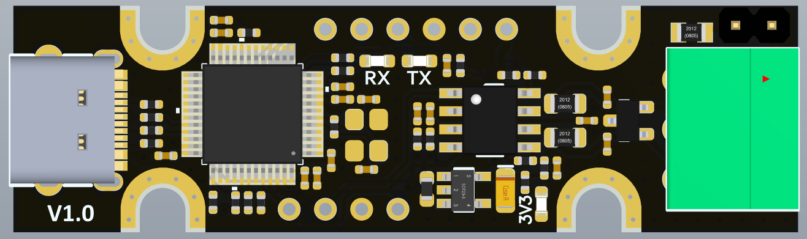
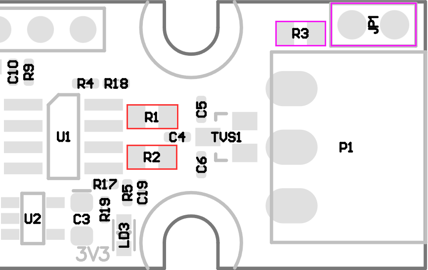
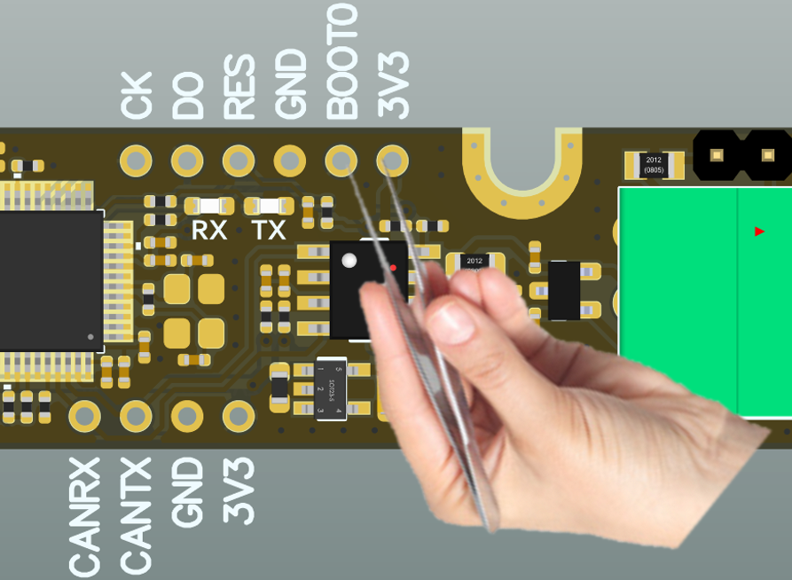

# 1. Introduction

UCAN is an open source USB-to-CAN interface board, based on STM32F072 and **candleLight** open source firmware, and supports linux/win/mac multi-platform. Of course, you can also develop your own firmware to use, it is completely open source.

# 2. Feature

- Supports CAN2.0A and B, baud rates up to 1M

- Compatible with candleLigtht V1 hardware pin assignment

- Native socketcan support with candleLight firmware

- 3-pin screw plug terminal: CANH, CANL,  GND

- Headers to enter bootloader for firmware updates and SWD interface

- Headers to CAN interface before transceiver

- Headers to enable/disable termination，On-board termination resistors（2 x 59R） are used by default

  

# 3.hardware

UCAN is designed based on STM32F072CBT6, PA11/PA12 is connected to USB-C, and PA8/PA9 is connected to CAN interface. The detailed circuit can refer to the schematic diagram.

## 3.1 About Terminating Resistors

We provide two ways to terminate the resistor, the default is composed of two 59R resistors (R1/R2), as shown in the red position in the figure. The alternate location consists of a 120R resistor and a two-pin jumper, shown in magenta. There is no difference in general use, the default is onboard. More info please check the [Schematic Diagram](https://github.com/FYSETC/UCAN/blob/main/Hardware/UCAN%20V1.0%20SCH.pdf).

我们提供了两种端接电阻的方式，默认是由两颗59R电阻（R1/R2）组成，如图红色位置。备用位置是由120R电阻和一个两pin跳线组成，如图洋红色所示。一般地使用这并没有区别，默认板载即可。

# 4. Firmware

UCAN has already burned the firmware when it leaves the factory. Generally, there is no need to burn it again. If the CAN device appears on the computer plugged into windows PC , it means that it is working normally.

If you want to flash the firmware again, follow the steps below:

1. Prepare a tweezers or wire; a USB-C data cable that can communicate;

2. open https://canable.io/updater/canable1.html
3. Use tweezers or wires to short-circuit BOOT0 and 3.3V until the USB cable is plugged in and the board is powered .At this time, the board will enter DFU mode, and the webpage will detect the device.

   

4. Click “Connect and upload”button to burn the firmware

# 5. Related documents:

All files (Include Schematic Diagram and 3D Step file.) are all on github at:

https://github.com/FYSETC/UCAN/tree/main